# TaskMaster

## Lab 26

* In This Lab We Will To Create Three pages in android Studio IDE .
* First Page Is A home page that contains a text View and image , two buttons 
    1. first button is Add Task that will move us to the AddTask page
    2. second button is All Task that will move us to the AllTasl page
* Second Page is AddTask page that contain two edit text to allow to user add new task.
* Third Page is AllTask page that contain title for this page and image.

## Home Page 
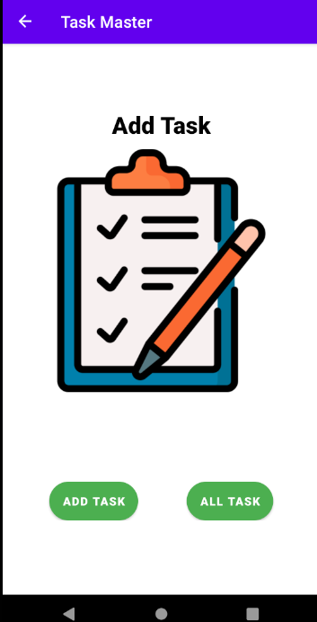

___

## Lab 27

* in this lab i will continuo work on TaskMaster Repo to do some features these features is :

    1. the user can be go to the setting page and enter his name thin click to save after this the user can see his name in the home page .
    2. in the home pabe we have spinner that contain all of the task . when the user click on one from this list will move to the taskDetails page that contains on the name for this task and description .
## Home Page  

## Setting Page

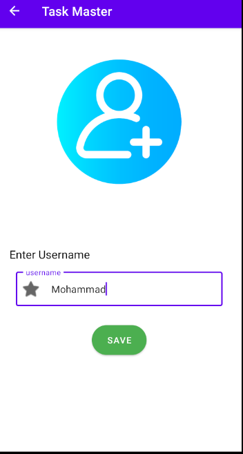

## TaskDetails Page

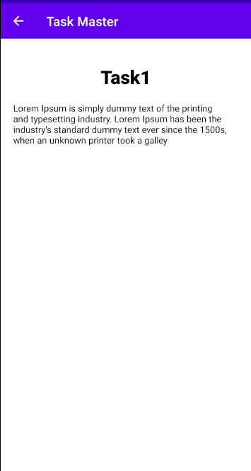

___

## Lab 28 

* in this lab i will to continuo work on Task Mater Tepo to add some features to the myApp :  
    1. the user can to see all task inside RecyclerView 
    2. When the user click on any item inside RecyclerView will move to the taskDetails page and will see the name and bode for this task 

## Home Page With RecyclerView for All Tasks

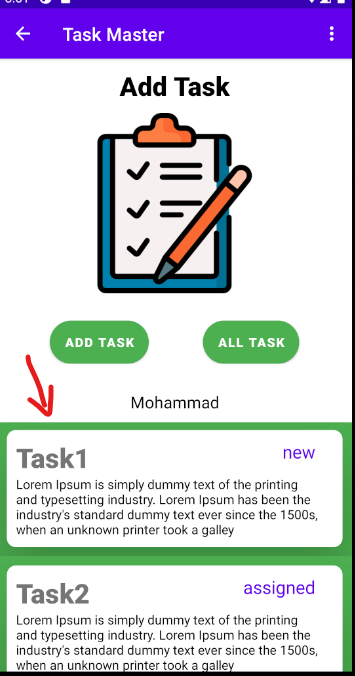

## Task Details Page With The Title And Body For Every Task Inside The Home Page

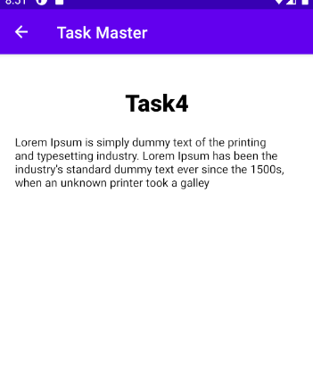

___

## Lab 29

* in this lab i will to continuo work on Task Mater Tepo to add some features to the myApp :  
    1. the user can add the task add descreption then display it in the RecyclerView inside home page.
    2. when the user click on any item inside RecyclerView will move to the taskDetails page and will see the name and body, statu fro this task.
* in this Lab I use the Room library to store data in my local storage and retrive it from the Room database

## AddTask page

* in this page the user can add the task and description for it then click submit

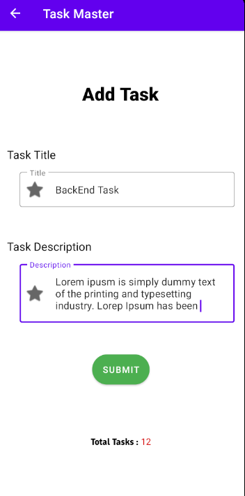

## Home Page With RecyclerView For All Tasks That The User Add It

* after the user add the task, it will add inside RecyclerView in Home Page.

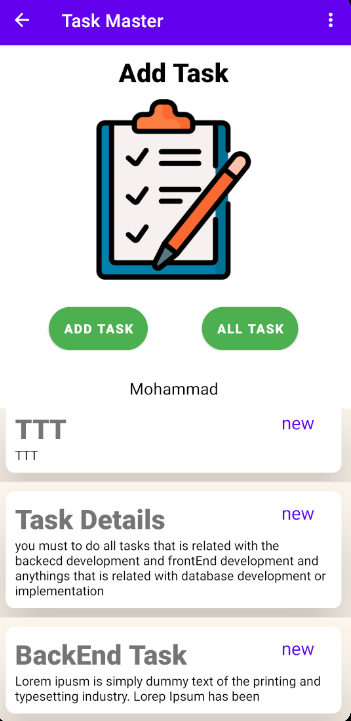

## Task Details Page

* When the user click on any item inside RecyclerView will move to another page to display the title and description, state for this item.

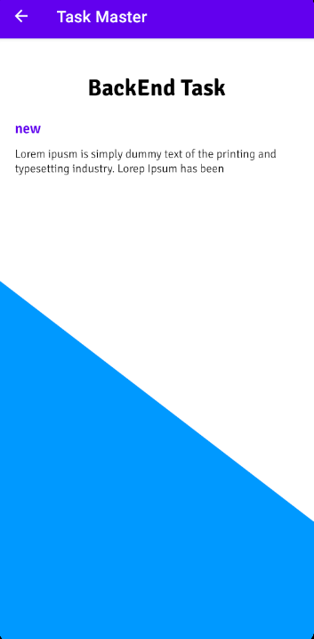

___

## Lab 31 

* in this lab i do some Test Function to my TaskMaster App with use Espresso Library 
* I add spinner widget to the addTask Page to allow for user to select the state for him task.

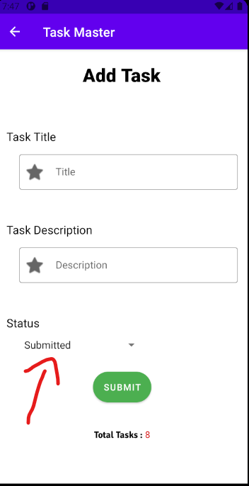

___
 
## Lab32 

* in this lab I'm connect my App with dynamodb
* i fitch all data inside dynamodb with API
* do sync between API and DataStore.

___ 

## Lab33 

* in this lab i will continuo work on TaskMaster Repo to do some features these features is :
    1. when the user add a Task he can to select any team he want to put him task inside it 
    2. in the setinng page the user can select any teams he want to display it inside MainActivity .

## Home Activity

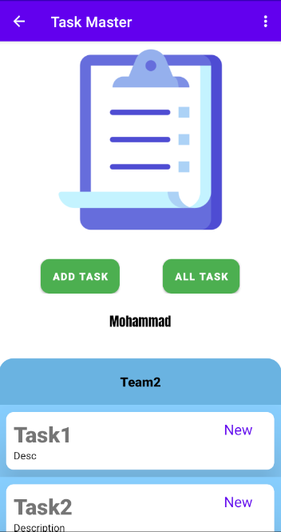

___

## AddTask Activity

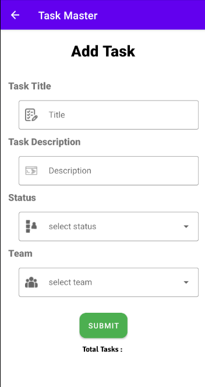

___

## Setting Activity

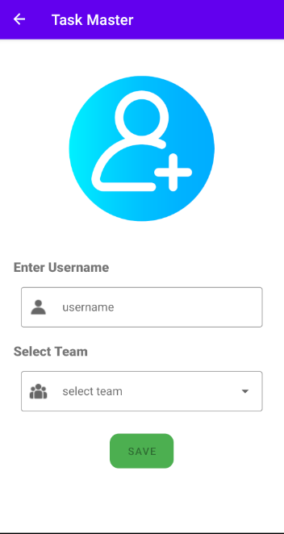

___

## LAB 34 

* In this lab i do some steps to prepare my App for release these steps is  :
    - Remove all log calls.
    - Remove android:debuggable from mainefest file.
    - Generate Signed Bundle / APK.
    - Transfer the APK file to the App root Folder.
    - [APK File](app-release.apk)

___

## LAB 36

* in this lab i will to continuo work on Task Mater Tepo to add some features to the myApp : 
    1. user can rejister to enter the app .
    2. after the user do signup he will Verify your email from code number.
    3. then user can login and logout to my App.

## Login Activity

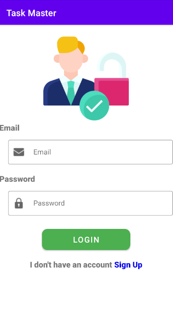

___

## SignUp Activity 

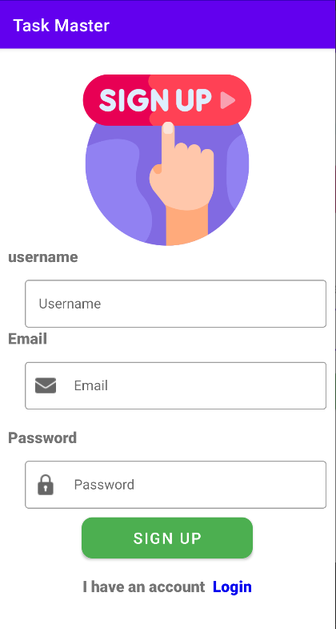

___

## Verify Activity

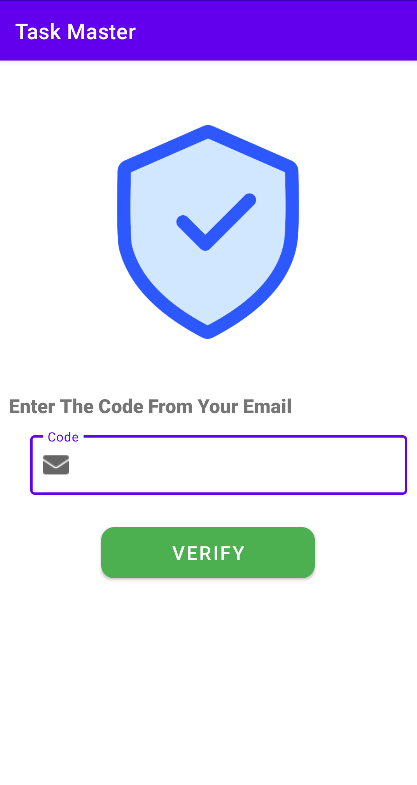

___

## Logout Button 

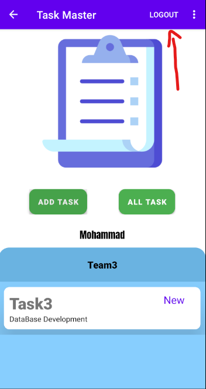

___

# Lab 37

* in this lab i will to continuo work on Task Mater Repo to add some features to the myApp :
    - the user can upload image from his phone when he add a new task.
    - user can see this image in TaskDetails Activity.

## Add Task Activity

* Before the user upload the image he can see Upload image button with icon(X) drawable

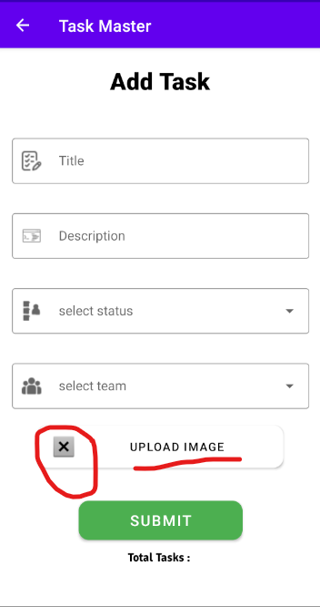

* After the user upload the image he can see Upload image button with checkBox on icon drawable

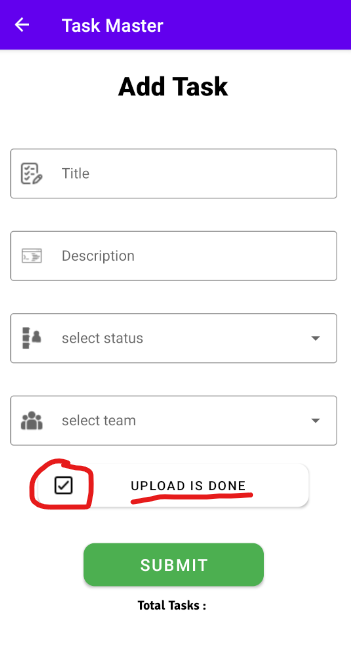

___

## TaskDetails Activity

* The user can see the Image Task when he click on any task inside RecyclerView.

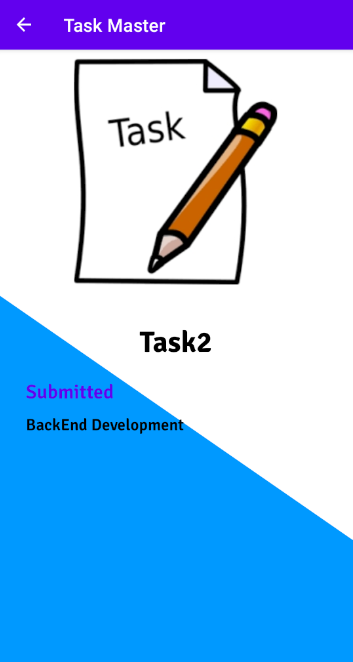

# Lab 39

* in this lab when the user add new task the curretn location for him will be saved automaticlly then display it in the taskDetails Activity.

## Task Details Activity

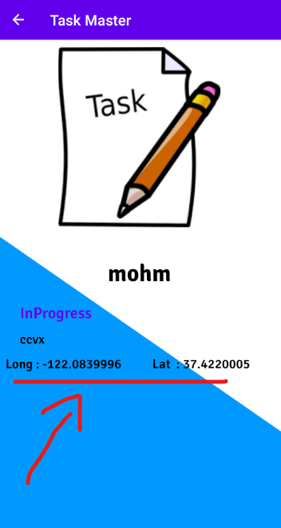

___

# Lab 41 

* in this lab i will to add record action and convert text to speech.

## Task Details Activity

* when the user click on the floation button will listen to the description for this task.

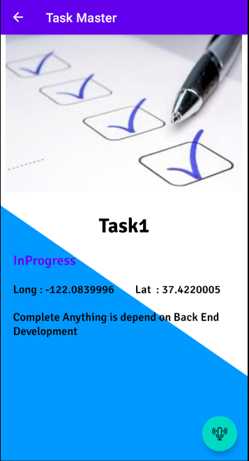

___