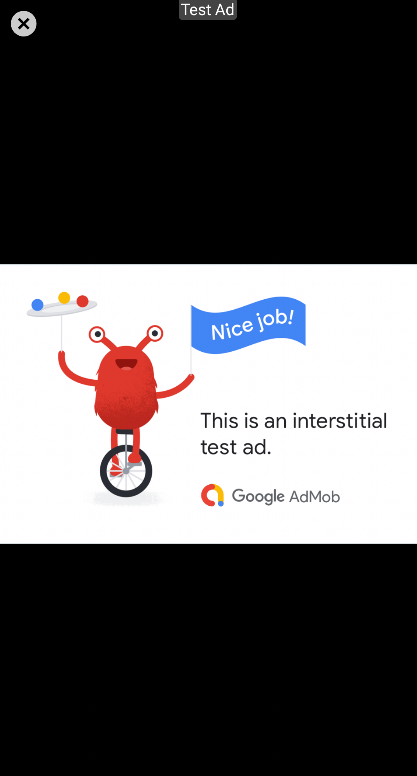

# TaskMaster App

* I build this App to help users to add anew task for any teams and he can to see the details for this task from another page inside the app.

## App Freatures

1. The user can create account to login for TaskMaster App.
2. The user can add any task and specify a team for this task.
3. The user can logout from the current account and he can see his proile in TaskMaster App.
4. The Advertisement Available in TaskMaster App.

## Screenshots

|        |  |                     |
| :---------- | :--------:  |       ----------:        |
|       |   |       |
|       |   |       |
|   |       |         |
|   |       |         |

## Database schema
